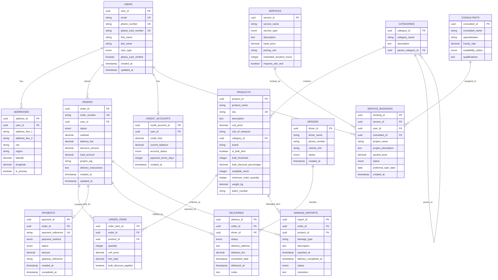

# DEPARTMENT OF COMPUTER SCIENCE

## DCIT 208 - SOFTWARE ENGINEERING

### DCIT 208 | SEMESTER II | 2024/25 ACADEMIC YEAR | COURSE PROJECT

# SYSTEM REQUIREMENTS SPECIFICATION (SRS)

## eBuildify Platform - Building Materials Delivery System

**Team:** BuildTech Solution  
**Client:** Sol Little By Little Enterprises  
**Document Version:** 1.0  
**Date:** July 30, 2025

---

## 1. Functional Overview & Use-Case Model

### Problem Recap

Sol Little By Little Enterprises currently processes orders manually through calls and WhatsApp, causing errors, delays, and inventory discrepancies. The eBuildify platform will automate order processing, provide real-time inventory management, enable multiple payment methods including credit facilities, and optimize delivery logistics. The system targets both B2B contractors and B2C customers, aiming to increase sales by 30% and reduce order fulfillment time by 40% within six months.

### Use-Case Diagram

```mermaid
graph LR
    %% Actors
    subgraph Actors
        direction LR
        A[👤 Customer]
        B[🏗️ Contractor]
        C[👨‍💼 Admin]
        D[🚛 Driver]
        E[👨‍🔬 Consultant]
        F[💰 Finance Team]
        G[📦 Warehouse Staff]
        H[🤖 System]
    end

    subgraph eBuildify["🏢 eBuildify Platform"]
        direction LR

        subgraph Customer_Journey["Customer & Contractor Actions"]
            direction TB
            subgraph Shopping["Shopping & Ordering"]
                UC2[Browse Product Catalog]
                UC3[Search & Filter Products]
                UC4[Add to Cart]
                UC5[Compare Products]
                UC6[Place Order]
                UC7[Make Payment]
            end
            subgraph Account_Mgmt["Account & Order Management"]
                UC1[Register with Ghana Card]
                UC8[Track Order Status]
                UC9[Report Damaged Items]
                UC10[Reorder from History]
                UC11[Assign Pickup Person]
                UC12[Rate & Tip Driver]
            end
            subgraph B2B_Features["B2B & Contractor Tools"]
                UC24[Tag Orders by Project]
                UC25[Request VAT Exemption]
                UC26[Multi-site Delivery]
                UC27[Bulk Order Discounts]
            end
        end

        subgraph Financial_Services["Credit & Finance"]
            direction TB
            subgraph Credit_Mgmt["Credit Management"]
                UC13[Apply for Credit Terms]
                UC14[Set Payment Schedule]
                UC15[Link Payment Account]
                UC16[Receive Payment Reminders]
                UC17[Pay Outstanding Balance]
            end
        end

        subgraph Delivery_Logistics["Delivery & Fulfillment"]
            direction TB
            subgraph Delivery_Mgmt["Delivery Management"]
                UC42[Accept Delivery Assignment]
                UC43[Update Delivery Status]
                UC44[Report Delivery Issues]
                UC45[Collect Payment - COD]
                UC46[Confirm Delivery]
            end
        end

        subgraph Admin_&_Services["Admin & Professional Services"]
            direction TB
            subgraph Service_Booking["Service Booking"]
                UC18[Book Consultancy Service]
                UC19[Schedule Site Visit]
                UC20[Request Material Evaluation]
                UC21[Book Architectural Drawing]
                UC22[Request Building Contract]
                UC23[Rent Equipment]
            end
            subgraph Admin_Mgmt["Admin Management"]
                UC28[Manage Product Catalog]
                UC29[Process Credit Applications]
                UC30[Assign Delivery Routes]
                UC31[Monitor Sales Analytics]
                UC32[Manage User Roles]
                UC33[Handle Returns/Refunds]
                UC34[Manage Consultants]
            end
        end

        subgraph Automation["System Automation"]
            direction TB
            UC35[Calculate Distance Pricing]
            UC36[Send Payment Reminders]
            UC37[Apply Late Penalties]
            UC38[Sync Inventory]
            UC39[Generate Reports]
            UC40[Send Birthday Wishes]
            UC41[Process Automatic Payments]
        end
    end

    %% Actor Relationships
    A --> Shopping
    A --> Account_Mgmt
    A --> Financial_Services
    A --> Service_Booking

    B --> Shopping
    B --> B2B_Features
    B --> Financial_Services

    C --> Admin_Mgmt
    C --> Automation

    D --> Delivery_Mgmt

    E --> Service_Booking

    F --> Admin_Mgmt
    F --> Automation

    G --> Admin_Mgmt
    G --> Automation

    H --> Automation
    H --> Admin_Mgmt
    H --> Delivery_Logistics
    H --> Financial_Services

    %% Use Case Dependencies
    UC6 -.->|includes| UC35
    UC7 -.->|includes| UC41
    UC13 -.->|includes| UC29
    UC17 -.->|includes| UC37
    UC8 -.->|includes| UC43
    UC9 -.->|includes| UC44
    UC27 -.->|extends| UC6
    UC26 -.->|extends| UC6
    UC12 -.->|extends| UC46
```

### Use-Case Descriptions

**UC1 - Register with Ghana Card**

- **Actor:** Customer
- **Trigger:** New user accesses registration page
- **Normal Flow:** User provides personal details, uploads Ghana Card image, system validates card details, creates verified account

**UC2 - Browse Product Catalog**

- **Actor:** Customer, Contractor
- **Trigger:** User navigates to products section
- **Normal Flow:** System displays categorized products with filtering options, shows availability and pricing

**UC6 - Place Order**

- **Actor:** Customer, Contractor
- **Trigger:** User proceeds to checkout from cart
- **Normal Flow:** System calculates delivery fees, applies bulk discounts if applicable, processes order with chosen payment method

**UC13 - Apply for Credit Terms**

- **Actor:** Customer, Contractor
- **Trigger:** B2B user requests credit facility
- **Normal Flow:** User submits credit application with required documents, admin reviews and approves/rejects

**UC18 - Book Consultancy Service**

- **Actor:** Customer
- **Trigger:** User selects service booking option
- **Normal Flow:** User selects service type, provides project details, system matches with available consultant, generates quote

**UC35 - Calculate Distance Pricing**

- **Actor:** System
- **Trigger:** User enters delivery address during checkout
- **Normal Flow:** System calculates distance from warehouse, applies distance-based pricing formula, displays delivery cost

---

## 2. User Stories

### EPIC 1: Order Management System (Must Have)

**US-001:** As a customer, I want to browse products by category with filters so I can find materials fast.

- **Acceptance Criteria:** Filter by ≥3 attributes, intuitive UI (Jumia-style)
- **Priority:** Must
- **Traceability:** UC2

**US-002:** As a contractor, I want tiered bulk pricing applied automatically so I get volume discounts.

- **Acceptance Criteria:** 1.5% discount triggers for ≥100 units of cement/iron rods/quarter rods
- **Priority:** Must
- **Traceability:** UC27

**US-003:** As any user, I want my cart saved offline so I can continue ordering in low-connectivity areas.

- **Acceptance Criteria:** Cart persists after refresh, stores locally when offline
- **Priority:** Must
- **Traceability:** UC4

**US-004:** As a customer, I want to search materials by brand or type so I don't scroll endlessly.

- **Acceptance Criteria:** Search bar + auto-suggestions with keywords
- **Priority:** Should
- **Traceability:** UC3

**US-005:** As a user, I want product comparison (e.g., cement A vs B) so I can choose wisely.

- **Acceptance Criteria:** Compare at least 3 items with side-by-side specs
- **Priority:** Should
- **Traceability:** UC5

**US-006:** As a user, I want one-click reordering from order history so I save time.

- **Acceptance Criteria:** Reorder replicates previous cart in ≤3 clicks
- **Priority:** Must
- **Traceability:** UC10

**US-007:** As a customer, I want to assign someone else to pick up my order so I don't have to be physically present.

- **Acceptance Criteria:** Pickup person details captured, ID verification required, SMS notification to both parties
- **Priority:** Should
- **Traceability:** UC11

### EPIC 2: Payment & Checkout (Must Have)

**US-008:** As a user, I want to pay via MTN MoMo/Vodafone/Telecel Cash so I can use my preferred method.

- **Acceptance Criteria:** Flutterwave integration for MTN, Vodafone, Telecel; success/failure callback
- **Priority:** Must
- **Traceability:** UC7

**US-009:** As a B2B client, I want to request credit terms at checkout so I can delay payment.

- **Acceptance Criteria:** "Request Credit" opens flow requiring admin approval + account details
- **Priority:** Must
- **Traceability:** UC13

**US-010:** As a credit customer, I want to set up automatic payment from my account so I don't miss due dates.

- **Acceptance Criteria:** Account linking (bank/MoMo/Telecel/virtual card), payment schedule setup, reminder notifications 3 days before due
- **Priority:** Must
- **Traceability:** UC14, UC15

**US-011:** As a COD customer, I want to input cash amount before delivery so I prepare exact change.

- **Acceptance Criteria:** Amount field editable on checkout → visible to assigned driver
- **Priority:** Should
- **Traceability:** UC7

**US-012:** As the system, I must apply 50% additional fee to defaulted credit purchases to recover costs.

- **Acceptance Criteria:** Automatic fee calculation, client notification, updated invoice generation
- **Priority:** Must
- **Traceability:** UC37

**US-013:** As the system, I must apply 2% penalty for late credit payments after multiple notifications.

- **Acceptance Criteria:** Penalty calculation after 3 SMS/email reminders, automatic account deduction
- **Priority:** Must
- **Traceability:** UC37

### EPIC 3: Customer Registration & Verification (Must Have)

**US-014:** As a new customer, I must provide Ghana Card details during registration so the company can verify my identity.

- **Acceptance Criteria:** Ghana Card number validation, photo upload, address verification, secure data storage
- **Priority:** Must
- **Traceability:** UC1

**US-015:** As a verified customer, I want to receive birthday and holiday greetings with special offers so I feel valued.

- **Acceptance Criteria:** Automated birthday/holiday detection, personalized messages, promotional code generation
- **Priority:** Should
- **Traceability:** UC40

**US-016:** As one of the first 20 customers, I want special incentive packages so I'm rewarded for early adoption.

- **Acceptance Criteria:** Customer counter, special discount codes, exclusive offers, priority support access
- **Priority:** Must
- **Traceability:** UC1

### EPIC 4: Delivery Logistics & Pricing (Should Have)

**US-017:** As a customer, I want to know delivery costs upfront based on my location so I can budget accurately.

- **Acceptance Criteria:** Distance calculator integration, transparent pricing display at checkout, cost breakdown
- **Priority:** Must
- **Traceability:** UC35

**US-018:** As a customer, I want to tip delivery drivers for exceptional service so I can show appreciation.

- **Acceptance Criteria:** Tip option at delivery confirmation, direct payment to driver account, rating system
- **Priority:** Should
- **Traceability:** UC12

**US-019:** As a customer, I must report damaged goods within 1-2 hours of delivery to be eligible for replacement.

- **Acceptance Criteria:** Time-stamped delivery confirmation, countdown timer for damage reports, automatic rejection after window
- **Priority:** Must
- **Traceability:** UC9

**US-020:** As a dispatch manager, I want to assign orders to drivers by zone to reduce travel times.

- **Acceptance Criteria:** Drag-and-drop order assignment on map or dropdown
- **Priority:** Should
- **Traceability:** UC30

### EPIC 5: B2B Contractor Portal & Services (Must Have)

**US-021:** As a contractor, I want to tag orders by project (e.g., Site A, Site B) so I track budgets.

- **Acceptance Criteria:** Add project label to order form → searchable in history
- **Priority:** Must
- **Traceability:** UC24

**US-022:** As an admin, I need to process VAT-exemption approvals so compliant contractors get tax relief.

- **Acceptance Criteria:** Document upload + verification → approval dashboard for finance
- **Priority:** Must
- **Traceability:** UC25

**US-023:** As a customer, I want to book consultancy services (architectural drawings, quantity surveying, supervision) so I get professional support.

- **Acceptance Criteria:** Service booking interface, consultant calendar, project requirements form, quote generation
- **Priority:** Must
- **Traceability:** UC18, UC21

**US-024:** As a contractor, I want full building contract services so I can outsource entire projects.

- **Acceptance Criteria:** Contract service request form, project scope definition, timeline and cost estimation
- **Priority:** Should
- **Traceability:** UC22

---

## 3. Preconditions & Postconditions

### US-001: Browse Products by Category

**Preconditions:**

1. Product database contains categorized items
2. Filter service is operational
3. User has internet connectivity

**Postconditions:**

1. Products are displayed according to selected filters
2. Filter selections are saved in user session
3. Product availability status is accurate

### US-002: Bulk Pricing Application

**Preconditions:**

1. User cart contains ≥100 units of eligible products (cement/iron rods/quarter rods)
2. Product pricing rules are configured in system
3. User is authenticated

**Postconditions:**

1. 1.5% discount is automatically applied to cart total
2. Discount details are visible to user
3. Order record contains bulk discount information

### US-008: Mobile Money Payment

**Preconditions:**

1. User has selected payment method as MTN MoMo/Vodafone/Telecel
2. Flutterwave gateway is operational
3. User has sufficient mobile money balance
4. Order total is within payment limits

**Postconditions:**

1. Payment transaction is initiated with gateway
2. User receives SMS confirmation
3. Order status is updated to "Payment Processing"
4. Payment callback is received and processed

### US-014: Ghana Card Registration

**Preconditions:**

1. User provides valid Ghana Card number
2. Ghana Card image is clear and readable
3. Ghana Card verification service is available

**Postconditions:**

1. User account is created with verified status
2. Ghana Card data is encrypted and stored securely
3. User receives email/SMS verification
4. Account is eligible for credit applications

### US-017: Distance-Based Delivery Pricing

**Preconditions:**

1. User has entered valid delivery address
2. Google Maps API is operational
3. Delivery zones and pricing rules are configured
4. Cart contains items with weight/size data

**Postconditions:**

1. Delivery fee is calculated and displayed
2. Estimated delivery time is shown
3. User can proceed with calculated delivery cost
4. Delivery information is saved with order

### US-019: Damage Reporting

**Preconditions:**

1. Order has been marked as delivered
2. Current time is within 1-2 hours of delivery timestamp
3. User is authenticated and owns the order
4. Delivery confirmation exists in system

**Postconditions:**

1. Damage report is recorded with timestamp
2. Report status is set to "Pending Review"
3. Admin notification is triggered
4. Report deadline timer is stopped

---

## 4. Story Sizing & Epics

### Epic Scale Stories (>2 days effort)

**Epic E1: Complete Order Management System**

- **Decomposition:** US-001, US-002, US-003, US-006, US-007
- **Estimated Effort:** 15 days
- **Priority:** Must Have

**Epic E2: Payment & Credit Management System**

- **Decomposition:** US-008, US-009, US-010, US-012, US-013
- **Estimated Effort:** 12 days
- **Priority:** Must Have

**Epic E3: Customer Registration & Verification**

- **Decomposition:** US-014, US-015, US-016
- **Estimated Effort:** 8 days
- **Priority:** Must Have

**Epic E4: Service Booking & Consultancy Platform**

- **Decomposition:** US-023, US-024
- **Estimated Effort:** 10 days
- **Priority:** Must Have

**Epic E5: Advanced Delivery & Logistics**

- **Decomposition:** US-017, US-018, US-019, US-020
- **Estimated Effort:** 8 days
- **Priority:** Should Have

### Individual User Stories (<2 days effort)

- **US-004:** Search & Filter Products - 1.5 days
- **US-005:** Product Comparison - 1 day
- **US-011:** COD Cash Amount Input - 0.5 days
- **US-021:** Project Tagging - 1 day
- **US-022:** VAT Exemption Processing - 1.5 days

---

## 5. Non-Functional Requirements

| ID           | Quality Attribute | Requirement                                           | Rationale                                                 | Measurement/Test                       |
| ------------ | ----------------- | ----------------------------------------------------- | --------------------------------------------------------- | -------------------------------------- |
| NFR-PERF-01  | Performance       | Product & checkout pages load in <3 seconds on 3G     | Poor connectivity in Ghana requires optimized performance | Load testing with 3G simulation        |
| NFR-PERF-02  | Performance       | Support 500+ concurrent users during peak times       | Monthly promotions and rainy season create traffic spikes | Load testing with 500 concurrent users |
| NFR-SEC-01   | Security          | PCI-DSS compliant payment processing                  | Legal requirement for card payment handling               | Third-party security audit             |
| NFR-SEC-02   | Security          | Ghana Card data encrypted at rest and in transit      | Personal data protection compliance                       | Encryption verification testing        |
| NFR-SEC-03   | Security          | Role-based access control with audit trails           | Prevent unauthorized admin actions                        | Access control testing                 |
| NFR-AVAIL-01 | Availability      | 99.9% uptime excluding scheduled maintenance          | Business operations depend on platform availability       | Uptime monitoring over 30 days         |
| NFR-AVAIL-02 | Availability      | Offline cart functionality in poor connectivity areas | Users in remote areas have unreliable internet            | Offline functionality testing          |
| NFR-USAB-01  | Usability         | Mobile-first responsive design                        | 80%+ users access via mobile devices                      | Cross-device testing                   |
| NFR-USAB-02  | Usability         | Large font toggle for accessibility                   | Inclusive design requirement                              | Accessibility audit                    |
| NFR-SCALE-01 | Scalability       | Support expansion to other regions within 12 months   | Business growth plans                                     | Architecture review                    |
| NFR-SCALE-02 | Scalability       | Database designed for 10x current data volume         | Anticipate rapid business growth                          | Database performance testing           |
| NFR-INTEG-01 | Integration       | Real-time inventory sync with Google Sheets           | Existing inventory management system                      | Integration testing                    |
| NFR-INTEG-02 | Integration       | Multiple payment gateway support                      | Redundancy and user preference                            | Payment gateway testing                |
| NFR-COMP-01  | Compliance        | VAT calculation per Ghana tax regulations             | Legal tax compliance requirement                          | Tax calculation validation             |
| NFR-COMP-02  | Compliance        | Cement batch number traceability                      | Safety and regulatory compliance                          | Batch tracking verification            |
| NFR-RELI-01  | Reliability       | Data backup every 4 hours                             | Prevent data loss from system failures                    | Backup and recovery testing            |
| NFR-RELI-02  | Reliability       | Automatic failover for payment processing             | Ensure payment reliability                                | Failover testing                       |

---

## 6. Glossary & References

### Glossary

**B2B (Business-to-Business):** Commercial transactions between businesses, specifically contractors and construction companies.

**B2C (Business-to-Consumer):** Commercial transactions between business and individual consumers.

**Bulk Discount:** Automatic price reduction applied when purchasing ≥100 units of eligible products.

**COD (Cash on Delivery):** Payment method where customer pays upon receipt of goods.

**Credit Facility:** Business arrangement allowing approved customers to purchase goods and pay later.

**Distance-Based Pricing:** Delivery fee calculation method using geographic distance from warehouse.

**Ghana Card:** National identification card required for customer verification and registration.

**Mobile Money (MoMo):** Digital payment service using mobile phone accounts for transactions.

**PCI-DSS:** Payment Card Industry Data Security Standard for secure payment processing.

**PWA (Progressive Web App):** Web application with native app-like functionality and offline capabilities.

**Stock Reservation:** Temporary hold on inventory during checkout process to prevent overselling.

**Telecel Cash:** Mobile money service provided by Telecel Ghana telecommunications company.

**VAT Exemption:** Tax relief for qualified contractors with valid certificates.

### References

Kendall, K. E., & Kendall, J. E. (2019). _Systems Analysis and Design_ (9th ed.). Pearson Education.

Pressman, R. S., & Maxim, B. R. (2019). _Software Engineering: A Practitioner's Approach_ (9th ed.). McGraw-Hill Education.

Sommerville, I. (2015). _Software Engineering_ (10th ed.). Pearson Education.

Sol Little By Little Enterprises. (2024). _Business Requirements Document - eBuildify Platform_. Internal Document.

BuildTech Solutions. (2024). _eBuildify API Specification & Documentation v2.0_. Technical Specification.

---

## 7. Supplementary Diagrams

### Data Flow Diagram (DFD) - Level 0 (Context Diagram)

### Data Flow Diagram - Level 1 (System Decomposition)

### Entity Relationship Diagram (ERD)

### System Architecture Diagram

### Sequence Diagram - Order Processing Flow

---

## Summary

This Software Requirements Specification document provides comprehensive coverage of the eBuildify platform requirements following the DCIT 208 framework. The system addresses the client's core business needs:

### Key Features Covered:

- **Complete order management** with bulk pricing and offline cart functionality
- **Advanced payment system** supporting multiple Ghanaian payment methods and credit facilities
- **Customer verification** using Ghana Card integration for regulatory compliance
- **Professional service booking** for consultancy and construction services
- **Sophisticated delivery management** with distance-based pricing and damage reporting
- **Administrative controls** with role-based access and comprehensive analytics

### Technical Architecture:

- **Microservices-based** design for scalability and maintainability
- **Progressive Web App** frontend for mobile-first experience with offline capabilities
- **RESTful API** design with comprehensive endpoint coverage
- **Secure data handling** with PCI-DSS compliance and encrypted Ghana Card storage

### Compliance & Quality:

- **Non-functional requirements** addressing performance, security, and scalability needs
- **Comprehensive traceability** linking use cases to user stories and acceptance criteria
- **Detailed data modeling** with proper normalization and relationship management
- **Integration specifications** for external services and payment gateways

The specification provides a solid foundation for the development team to implement the eBuildify platform according to client requirements while maintaining technical excellence and regulatory compliance.

**Document Status:** Complete and ready for development implementation
**Next Steps:** Development team review, technical architecture validation, and sprint planning
