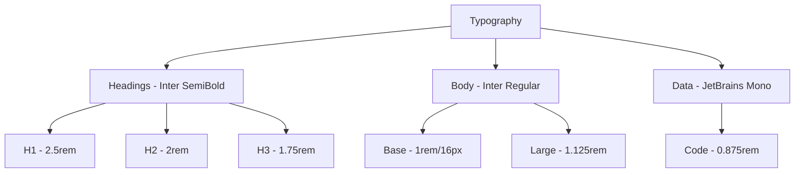
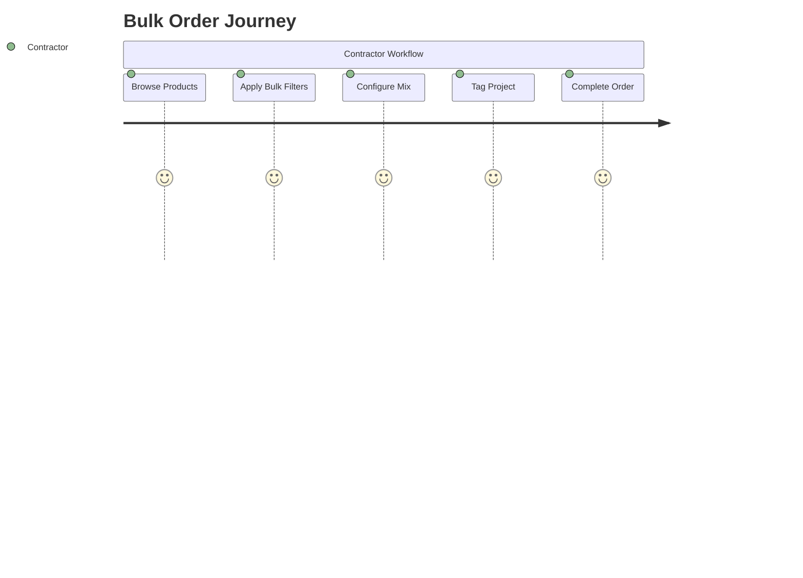
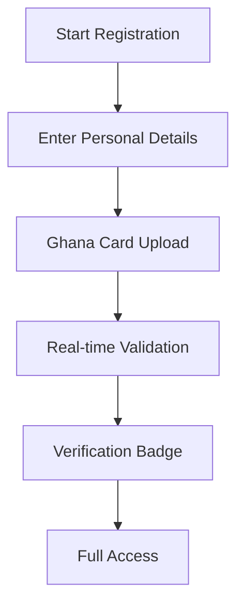
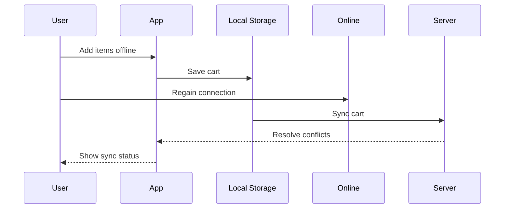
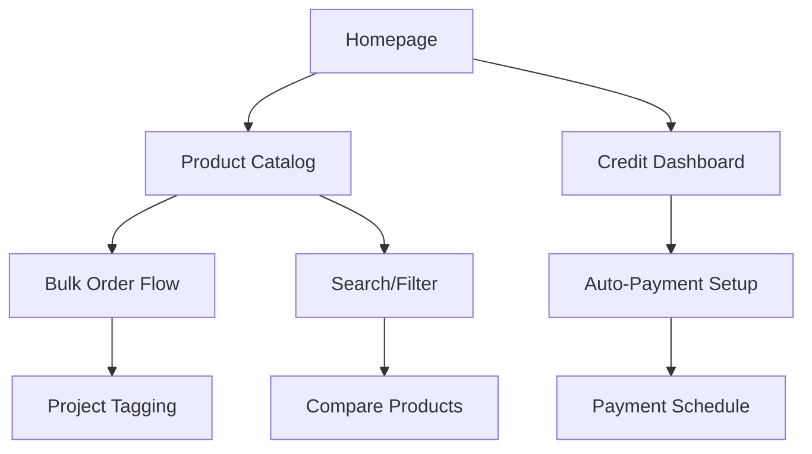
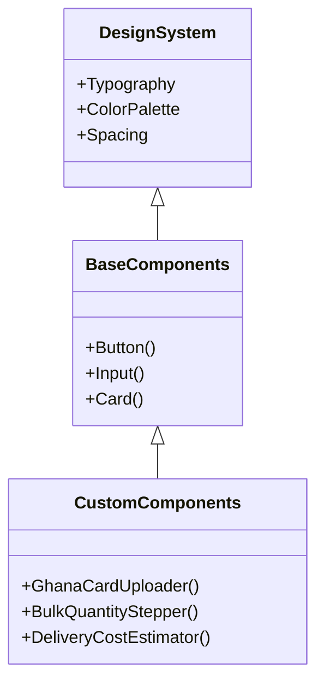
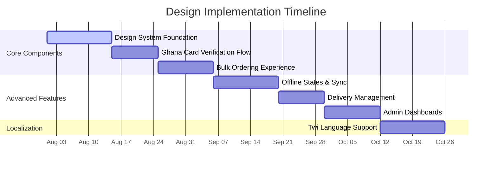

# Comprehensive UI/UX Design Proposal for eBuildify

## 1. Brand Identity & Visual System

### Enhanced Color Palette

| Role              | Color Code | Usage Example                 | Preview                                                          |
| ----------------- | ---------- | ----------------------------- | ---------------------------------------------------------------- |
| **Primary**       | `#3182CE`  | Main buttons, active elements | <div style="background:#3182CE; width:50px; height:20px;"></div> |
| **Secondary**     | `#F59E0B`  | Discount badges, highlights   | <div style="background:#F59E0B; width:50px; height:20px;"></div> |
| **Dark Neutral**  | `#1A202C`  | Headings, key text            | <div style="background:#1A202C; width:50px; height:20px;"></div> |
| **Light Neutral** | `#E2E8F0`  | Backgrounds, cards            | <div style="background:#E2E8F0; width:50px; height:20px;"></div> |
| **Ghana Accent**  | `#006B3F`  | Cultural elements, promotions | <div style="background:#006B3F; width:50px; height:20px;"></div> |
| **Success**       | `#38A169`  | Positive actions              | <div style="background:#38A169; width:50px; height:20px;"></div> |
| **Warning**       | `#DD6B20`  | Warnings                      | <div style="background:#DD6B20; width:50px; height:20px;"></div> |
| **Error**         | `#E53E3E`  | Errors, destructive actions   | <div style="background:#E53E3E; width:50px; height:20px;"></div> |

### Typography System



### Brand Personality Implementation

- **Visual Elements**:
  - Real construction worker imagery (avoiding stock photos)
  - Textured backgrounds resembling concrete/wood materials
  - Rounded corners with strategic sharp edges (8px radius)
  - Ghanaian pattern accents in headers/footers
- **Tone & Voice**:
  - Professional yet approachable language
  - Ghanaian proverbs for empty states ("Little by little...")
  - Construction industry terminology with tooltip explanations
  - Local measurement units (bags, bundles) with metric equivalents

---

## 2. Target User Personas & Journey

### User Distribution


### Priority User Journeys

#### 1. Cement/Iron Rod Bulk Ordering



#### 2. Ghana Card Verification Flow



#### 3. Offline-to-Online Recovery



### Pain Point Solutions

| Pain Point          | UX Solution                | Visual Indicator                                                                                                  |
| ------------------- | -------------------------- | ----------------------------------------------------------------------------------------------------------------- |
| Connectivity issues | Progressive loading states | <div style="background:#E2E8F0; border:1px solid #CBD5E0; border-radius:4px; padding:4px;">Offline badge</div>    |
| Complex orders      | "Project Kits" bundles     | <div style="background:#F59E0B20; border:1px solid #F59E0B; border-radius:4px; padding:4px;">Kit badge</div>      |
| Trust barriers      | Ghana Card verification    | <div style="background:#3182CE20; border:1px solid #3182CE; border-radius:4px; padding:4px;">Verified badge</div> |

---

## 3. Content & Feature Prioritization

### MVP Feature Hierarchy



### Ghana-Market Visual Requirements

| Element               | Requirement              | Implementation                                                                                                                             |
| --------------------- | ------------------------ | ------------------------------------------------------------------------------------------------------------------------------------------ |
| **Payment Methods**   | Local payment prominence | <div style="display:flex; gap:4px;"></div> |
| **Delivery Zones**    | Region-specific pricing  | Interactive map with zone boundaries                                                                                                       |
| **Measurement Units** | Local familiarity        | Toggle between metric/local units                                                                                                          |
| **Cultural Context**  | Ghanaian identity        | Flag elements in CTAs, local materials imagery                                                                                             |

### Media Strategy

| Phase       | Approach                       | Example                               |
| ----------- | ------------------------------ | ------------------------------------- |
| **1 (MVP)** | 3D product placeholders        |  |
| **2**       | Client-provided jobsite photos |  |
| **All**     | Ghanaian context visuals       |    |

---

## 4. Technical Constraints & Solutions

### Component Library Architecture



### Performance Optimization Techniques

```jsx
// Image Loading Component
const OptimizedImage = ({ src, alt }) => (
   e.target.classList.add("opacity-100")}
  />
);
```

### Enhanced Accessibility Features

| Feature                | Implementation                            | User Benefit                    |
| ---------------------- | ----------------------------------------- | ------------------------------- |
| **Vibration Patterns** | Different patterns for notifications      | Screen-independent alerts       |
| **High-Contrast Mode** | Toggle in profile settings                | Jobsites in bright sunlight     |
| **Voice Navigation**   | VoiceOver/TalkBack support                | Hands-free operation            |
| **Tap-and-Hold Help**  | Contextual construction term explanations | Industry knowledge gap bridging |
| **Twi Translations**   | Phase 2 localization                      | Broader user reach              |

---

## Design System Preview

### Component Specifications

| Component            | Mobile View                         | Desktop View                          | Key Features                           |
| -------------------- | ----------------------------------- | ------------------------------------- | -------------------------------------- |
| **Product Card**     |      |      | Bulk badge, Quick-add, Stock indicator |
| **Ghana Card Input** |    |    | Camera-first, Live validation          |
| **Credit Dashboard** |  |  | Payment timeline, Balance forecast     |
| **Offline Cart**     |      |      | Sync status, Conflict resolution       |

### Implementation Roadmap



> This comprehensive design balances Ghanaian construction industry requirements with exceptional usability, particularly addressing offline scenarios and complex ordering workflows. The Ghana Card verification flow should be prioritized to establish critical user trust early in the journey. All designs follow WCAG 2.1 AA+ standards with Ghana-specific enhancements.
